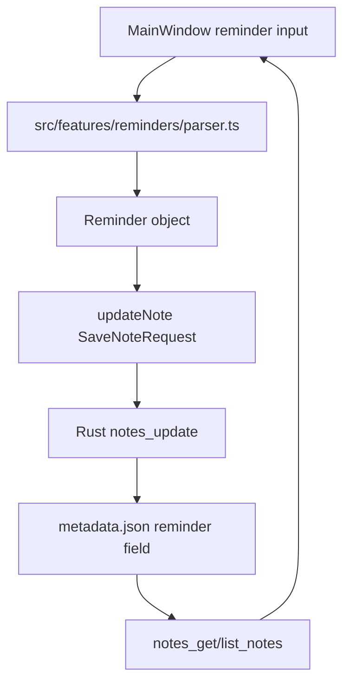

# 变更提案: reminder-presets

## 元信息

```yaml
类型: 新功能
方案类型: implementation
优先级: P1
状态: 已规划
创建: 2026-05-30
```

---

## 1. 需求

### 背景

用户希望花笺支持类似滴答清单的时间提醒预设：输入“明天下午四点”“每周一”“每月五号上午10点”“每个工作日”等口语化时间表达时，应用能自动识别并作为提醒。当前项目只有笔记、分类、Markdown 编辑、磁贴和设置能力，没有提醒数据模型或提醒 UI。

### 目标

- 为本地笔记增加提醒字段，支持一次性提醒和重复提醒。
- 增加口语化时间预设识别，覆盖用户确认的典型表达。
- 在主窗口编辑器内提供提醒输入、预设按钮、识别结果展示和清除入口。
- 保存提醒到本地笔记元数据，不接入滴答清单账号、云同步或外部 API。
- 补充单元测试，证明自然语言解析和数据持久化行为可验证。

### 约束条件

```yaml
时间约束: 无
性能约束: 解析在前端同步完成，不引入重型自然语言依赖
兼容性约束: 旧 metadata.json 无 reminder 字段时必须正常读取
业务约束: 本次只做本地提醒预设与存储，不做系统通知调度、滴答清单账号同步或第三方 API
```

### 验收标准

- [ ] 笔记数据模型支持 `reminder` 字段，旧笔记可兼容读取。
- [ ] 主窗口可输入“明天下午四点”“每周一”“每月五号上午10点”“每个工作日”等表达，并展示识别后的提醒摘要。
- [ ] 保存笔记后提醒字段持久化，重新读取笔记仍能看到提醒。
- [ ] 可清除提醒，清除后保存不再保留提醒字段。
- [ ] 至少覆盖前端自然语言解析测试、元数据转换测试、Rust 存储兼容测试。
- [ ] `npm run test` 与相关 Rust 测试通过。

---

## 2. 方案

### 技术方案

采用本地轻量实现：

- 在 TypeScript 与 Rust 的 `NoteMetadata`、`Note`、`SaveNoteRequest` 中增加可选 `reminder` 字段。
- 新建前端提醒解析模块，使用规则解析中文口语时间表达，输出标准 `Reminder` 对象。
- 主窗口标题区增加提醒输入区和预设按钮，识别后随 `updateNote()` 一起保存。
- 列表项和标题元信息区域展示简短提醒摘要。
- Rust 存储层把 reminder 写入 `metadata.json`，旧数据缺字段时默认为 `None`。
- 本次不新增后台通知线程或系统通知权限，避免扩大桌面壳风险。

### 影响范围

```yaml
涉及模块:
  - 笔记领域: 扩展 Note/NoteMetadata/SaveNoteRequest 和 Rust 存储
  - 前端应用壳: 主窗口新增提醒输入、预设按钮和摘要展示
  - 设置与本地化: 新增提醒相关文案
  - 构建与测试: 增加解析、数据转换、存储兼容测试
  - 知识库: 同步模块文档、CHANGELOG 和开发文档
预计变更文件: 12-18
```

### 风险评估

| 风险                           | 等级 | 应对                                                         |
| ------------------------------ | ---- | ------------------------------------------------------------ |
| 中文自然语言时间表达边界过大   | 中   | 明确首批支持范围，未识别时不给出错误保存，只提示无法识别     |
| 重复提醒语义与真实通知调度混淆 | 中   | reminder 中记录 repeat 规则和 nextAt，本次不承诺系统通知触发 |
| 旧 metadata.json 兼容问题      | 中   | serde default + TypeScript 可选字段，补充旧配置/旧元数据测试 |
| MainWindow 继续膨胀            | 中   | 抽出 `ReminderInput` 组件和 `reminders` feature 模块         |
| UI 与现有纸张风格不一致        | 低   | 使用克制的“日历纸签”风格，复用现有竹绿色、纸张色和小字号密度 |

### 方案取舍

```yaml
唯一方案理由: 本地规则解析 + 笔记元数据存储能满足用户确认的核心目标，风险可控，且符合花笺本地优先的架构。
放弃的替代路径:
  - 待办化完整任务系统: 会引入完成状态、任务列表、过滤和独立模型，超出本次“提醒预设”范围。
  - 滴答清单账号/API 同步: 需要授权、API 可用性确认和同步冲突处理，风险高且不符合本次本地实现选择。
  - 系统通知调度: 涉及后台定时、权限和跨平台通知，属于提醒触发阶段，不是本次预设识别与保存的最小闭环。
回滚边界: 回滚前端 reminder 模块和 UI、移除新增字段；已有 metadata 中的 reminder 字段为可选附加数据，不影响旧逻辑读取。
```

---

## 3. 技术设计

### 架构设计



### 数据模型

| 字段                  | 类型      | 说明                         |
| --------------------- | --------- | ---------------------------- | --------- | ---------- | -------- |
| `reminder.kind`       | `"once"   | "weekly"                     | "monthly" | "workday"` | 提醒类型 |
| `reminder.input`      | `string`  | 用户原始表达                 |
| `reminder.nextAt`     | `string`  | 下一次提醒 ISO 时间          |
| `reminder.timeOfDay`  | `string`  | HH:mm，本地时间              |
| `reminder.weekday`    | `number?` | 每周重复，1-7 表示周一到周日 |
| `reminder.dayOfMonth` | `number?` | 每月重复，1-31               |

### 解析范围

首批支持：

- 相对日期：今天、明天、后天。
- 时间段：早上/上午、下午、晚上。
- 明确时间：四点、4点、16点、上午10点、下午四点半。
- 每周：每周一、每星期一、每周五下午三点。
- 每月：每月五号上午10点、每月5日。
- 工作日：每个工作日、每工作日、工作日上午九点。
- 预设按钮：稍后、今晚、明早、明天下午、下周一、每周一、每月五号、每个工作日。

未支持表达保持不识别，不写入 reminder。

---

## 4. 核心场景

### 场景: 主窗口设置一次性提醒

**模块**: 前端应用壳 / 笔记领域
**条件**: 用户选中一篇内部笔记
**行为**: 在提醒输入框输入“明天下午四点”，选择识别结果并保存
**结果**: note.reminder 保存为 once，nextAt 指向明天 16:00。

### 场景: 设置重复提醒

**模块**: 前端应用壳 / 笔记领域
**条件**: 用户选中一篇内部笔记
**行为**: 输入“每月五号上午10点”或“每个工作日”
**结果**: reminder 保存 repeat 规则，并展示简短摘要。

### 场景: 清除提醒

**模块**: 前端应用壳 / 笔记领域
**条件**: 当前笔记已有 reminder
**行为**: 点击清除提醒并保存
**结果**: metadata 中该笔记不再保留 reminder。

---

## 5. 技术决策

### reminder-presets#D001: 使用本地规则解析，不引入第三方 NLP

**日期**: 2026-05-30
**状态**: ✅采纳
**背景**: 用户需要对齐滴答清单的口语化提醒预设，但当前项目是轻量本地应用，首批表达范围可明确限定。
**选项分析**:
| 选项 | 优点 | 缺点 |
|------|------|------|
| A: 本地规则解析 | 依赖少、可测试、可控、离线可用 | 覆盖范围需要逐步扩展 |
| B: 引入 NLP/日期解析库 | 覆盖更广 | 包体、中文兼容和行为不可控风险更高 |
| C: 接入滴答清单同步 | 与滴答生态更接近 | API、授权、同步冲突和隐私风险高 |
**决策**: 选择方案 A
**理由**: 与花笺本地优先和轻量定位一致，可快速覆盖用户列出的核心表达。
**影响**: 新增 reminders feature，扩展 notes 数据模型和 UI。

---

## 6. 验证策略

```yaml
verifyMode: test-first
reviewerFocus:
  - src/features/reminders/parser.ts
  - src-tauri/src/services/notes.rs 数据兼容
  - src/components/MainWindow.tsx 体积与职责边界
testerFocus:
  - 口语化表达解析: 明天下午四点、每周一、每月五号上午10点、每个工作日
  - 提醒字段保存、读取、清除
  - 旧 metadata 无 reminder 字段兼容
uiValidation: required
riskBoundary:
  - 不接入外部滴答清单账号或 API
  - 不新增系统通知调度和后台权限
  - 不删除用户笔记或迁移用户数据结构
```

---

## 7. 成果设计

### 设计方向

- **美学基调**: 日历纸签式精致工具感。提醒控件像夹在笔记标题下方的一条细窄纸签，密度高但不喧宾夺主。
- **记忆点**: 输入口语化时间后，识别结果以小型“时间纸签”浮现，包含重复节奏和下一次时间。
- **参考**: 滴答清单的快速日期识别体验，但视觉跟随花笺的纸张、墨色和竹绿色体系。

### 视觉要素

- **配色**: 纸张底色延续 `paper` / `paper-warm`，提醒强调用 `bamboo`，待识别或错误态用琥珀色。
- **字体**: 继续使用项目已有 `font-display` 与 `font-body`，不引入新字体以保持应用一致性。
- **布局**: 位于标题输入下方、元信息行上方或同一信息区，采用一行输入 + 紧凑预设按钮 + 识别摘要。
- **动效**: 识别结果切换使用轻微淡入，不添加干扰编辑的动画。
- **氛围**: 使用细边框、浅纸色背景和小圆角，避免卡片堆叠。

### 技术约束

- **可访问性**: 输入框、预设按钮、清除按钮必须有可理解标签；键盘可聚焦。
- **响应式**: 主窗口宽度不足时预设按钮换行，不能挤压标题输入。
