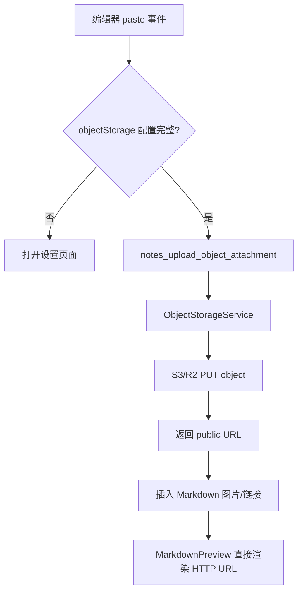

# 变更提案: object-storage-paste-upload

## 元信息

```yaml
类型: 新功能
方案类型: implementation
优先级: P1
状态: 已确认
创建: 2026-06-02
```

---

## 1. 需求

### 背景

当前应用已支持内部笔记本地附件和 WebDAV 快照同步，但编辑器尚不支持把剪贴板里的图片或文件直接上传到 R2/S3 等对象存储后插入笔记内容。用户需要在未配置存储时引导进入设置，在配置完成后粘贴图片和文件即可在 Markdown 内容中直接呈现。

### 目标

- 新增 R2/S3 兼容对象存储配置，保存到本机 `config.json`。
- 在笔记编辑区处理粘贴的图片和文件；对象存储未配置时打开设置页面。
- 对象存储已配置时上传粘贴文件，插入 Markdown 图片或文件链接。
- 图片通过公开 URL 在 Markdown 预览中直接显示，普通文件显示为可点击链接。
- 完成后自动运行 review 并 commit。

### 约束条件

```yaml
时间约束: 无
性能约束: 粘贴上传只处理用户显式粘贴的文件；不做后台批量同步
兼容性约束: 保留现有本地附件、WebDAV 同步和 Markdown 预览行为
业务约束: 外部文件编辑模式不绑定内部笔记，不启用本次对象存储粘贴上传
安全约束: WebDAV 快照不得包含对象存储密钥；对象存储公开 URL 由用户配置的 publicBaseUrl 生成
```

### 验收标准

- [ ] 设置面板可配置对象存储的 endpoint、region、bucket、access key、secret key、公开地址和对象目录。
- [ ] 未配置对象存储时，在笔记编辑区粘贴图片或文件会打开设置页面并给出错误提示。
- [ ] 已配置对象存储时，粘贴图片或文件会上传到对象存储，随后在光标处插入 Markdown。
- [ ] 图片 Markdown 使用公开 URL，预览区能直接显示；文件 Markdown 使用公开 URL 链接。
- [ ] WebDAV 快照不会同步对象存储凭据。
- [ ] 前端测试、构建和 Rust 测试通过，或明确记录环境型失败。
- [ ] 自动 review 后无阻断问题，并创建双语 commit。

---

## 2. 方案

### 技术方案

采用“本机配置 + Rust SigV4 PUT 上传 + Markdown 公开 URL 插入”的方案：

- 在 `AppConfig` 中新增 `objectStorage` 配置，使用 S3 兼容字段，默认关闭。
- 新建 Rust `ObjectStorageService`，通过 AWS Signature V4 对 `PUT /{bucket}/{objectKey}` 签名，上传粘贴文件字节。
- 上传返回 `ObjectUpload`，包含原始文件名、对象 key、公开 URL、MIME 分组、大小和上传时间。
- 前端通过 `notes_upload_object_attachment` command 上传剪贴板 `File` 的二进制内容。
- 编辑器 `onPaste` 检测 `clipboardData.files`；配置不完整时打开设置面板；配置完整时上传并插入 Markdown。
- 新建对象存储设置组件，延续现有设置面板的紧凑、安静、工作型视觉风格。

### 影响范围

```yaml
涉及模块:
  - src-tauri/src/services/notes.rs: AppConfig 增加对象存储配置和默认值
  - src-tauri/src/services/object_storage.rs: S3/R2 兼容上传服务
  - src-tauri/src/services/sync.rs: WebDAV 快照脱敏对象存储配置
  - src-tauri/src/lib.rs: 新增上传 command 并注册
  - src/features/settings/*: TypeScript 配置类型和设置 API 测试夹具更新
  - src/components/*: 设置面板新增对象存储区块，主窗口新增粘贴上传处理
  - src/features/notes/*: 上传 API、Markdown 生成和配置判断 helper
  - src/locales/*: 三语补充对象存储与粘贴上传文案
  - .helloagents/modules/* 与 开发文档.md: 同步项目事实
预计变更文件: 18-24
```

### 风险评估

| 风险                                 | 等级 | 应对                                                                            |
| ------------------------------------ | ---- | ------------------------------------------------------------------------------- |
| 对象存储密钥误进入 WebDAV 快照       | 高   | `SyncService::prepare_snapshot_config` 清空 `objectStorage`，恢复时保留本机配置 |
| S3/R2 endpoint 形态差异              | 中   | 采用 path-style `/{bucket}/{key}`；R2 和多数 S3 兼容服务支持该形式              |
| 粘贴大文件经 JSON 传输开销较大       | 中   | 只处理用户显式粘贴；本轮不做流式上传，后续可优化为 Tauri upload channel         |
| publicBaseUrl 未公开导致预览无法访问 | 中   | 配置完整性要求填写 publicBaseUrl；文档记录需要可公开访问                        |
| 主窗口文件过大继续膨胀               | 中   | 抽出粘贴上传 helper 和对象存储设置组件，MainWindow 只保留调度逻辑               |

### 方案取舍

```yaml
唯一方案理由: 公开 URL 插入是最符合“直接显示”的路径；上传在 Rust 侧完成，避免在前端暴露签名算法和跨域问题；配置保存在既有 AppConfig 中，符合项目已有设置模式。
放弃的替代路径:
  - 继续使用本地附件: 不满足用户明确选择的 R2/S3 对象存储方案。
  - 生成预签名 URL 后由前端上传: 仍需 Rust 签名服务，且增加一次前后端往返。
  - 上传后插入 floral-attachment 自定义协议: 只适合本地附件，无法跨设备和公开预览。
  - 引入完整 AWS SDK: 依赖体积和平台构建风险更高，本次只需 PUT 上传。
回滚边界: 可撤回 objectStorage 配置、ObjectStorageService、上传 command、设置组件和粘贴处理；现有本地附件与 WebDAV 同步可独立保留。
```

---

## 3. 技术设计

### 架构设计



### API 设计

#### Tauri command: `notes_upload_object_attachment`

- **请求**:

```ts
{
  noteId: string;
  fileName: string;
  contentType: string;
  data: number[];
}
```

- **响应**:

```ts
{
  fileName: string;
  objectKey: string;
  url: string;
  mimeGroup: "image" | "file";
  size: number;
  uploadedAt: string;
}
```

### 数据模型

| 字段                            | 类型    | 说明                         |
| ------------------------------- | ------- | ---------------------------- |
| `objectStorage.enabled`         | boolean | 是否启用粘贴上传             |
| `objectStorage.endpoint`        | string  | S3/R2 API endpoint           |
| `objectStorage.region`          | string  | SigV4 region；R2 可用 `auto` |
| `objectStorage.bucket`          | string  | Bucket 名称                  |
| `objectStorage.accessKeyId`     | string  | Access key                   |
| `objectStorage.secretAccessKey` | string  | Secret key                   |
| `objectStorage.publicBaseUrl`   | string  | 公开访问基础地址             |
| `objectStorage.objectPrefix`    | string  | 上传对象目录前缀             |

---

## 4. 核心场景

### 场景: 未配置对象存储时粘贴文件

**模块**: frontend-shell
**条件**: 当前为内部笔记，编辑器收到带文件的 paste 事件，`objectStorage` 配置不完整。
**行为**: 阻止默认粘贴，打开设置页面，显示对象存储设置提示。
**结果**: 不插入文件内容，不上传文件。

### 场景: 已配置对象存储时粘贴图片

**模块**: notes-domain / markdown-rendering
**条件**: 当前为内部笔记，配置完整，剪贴板包含图片文件。
**行为**: 前端读取文件字节并调用 Rust 上传；上传成功后插入 ``。
**结果**: 预览区通过 HTTP/HTTPS 图片 URL 直接显示。

### 场景: 已配置对象存储时粘贴普通文件

**模块**: notes-domain / markdown-rendering
**条件**: 当前为内部笔记，配置完整，剪贴板包含普通文件。
**行为**: 上传后插入 `[name](publicUrl)`。
**结果**: 预览区显示文件链接，点击按现有外链逻辑打开。

### 场景: WebDAV 快照同步

**模块**: sync
**条件**: 用户上传 WebDAV 快照。
**行为**: 快照配置脱敏，清空对象存储配置。
**结果**: 远端快照不包含对象存储密钥。

---

## 5. 技术决策

### object-storage-paste-upload#D001: 使用公开 URL 插入 Markdown

**日期**: 2026-06-02
**状态**: ✅采纳
**背景**: 用户要求粘贴图片、文件后在笔记内容中直接显示。
**选项分析**:
| 选项 | 优点 | 缺点 |
|------|------|------|
| A: 上传对象存储并插入公开 URL | Markdown 标准、预览天然支持、跨设备可访问 | 需要用户配置可公开访问地址 |
| B: 插入自定义协议 | 权限边界清晰，适合本地附件 | 不适合 R2/S3 远程对象 |
| C: 保存本地附件 | 已有实现，风险低 | 不符合用户已确认的对象存储方案 |
**决策**: 选择方案 A。
**理由**: 标准 Markdown 图片/链接最直接满足显示需求，也不扩大本地 asset protocol 权限。
**影响**: 对象存储 publicBaseUrl 必须配置为可访问域名或公共 bucket 地址。

### object-storage-paste-upload#D002: 手写最小 SigV4 PUT 而不引入 AWS SDK

**日期**: 2026-06-02
**状态**: ✅采纳
**背景**: 只需要 S3 兼容 PUT 上传，AWS SDK 会显著增加依赖和构建复杂度。
**选项分析**:
| 选项 | 优点 | 缺点 |
|------|------|------|
| A: 手写 SigV4 PUT | 依赖少，行为可控，适合 R2/S3 兼容目标 | 需要测试签名关键路径 |
| B: 引入 AWS SDK | 功能完整，维护成本低 | 依赖体积大，Tauri 构建风险更高 |
| C: 前端直传 | 前端逻辑简单 | 暴露签名/跨域问题，仍需后端参与 |
**决策**: 选择方案 A。
**理由**: 本功能只需一次 PUT，最小实现更符合当前桌面应用体量。
**影响**: 需增加 `hmac`、`sha2`、`hex` 依赖，并补充签名输入测试。

---

## 6. 验证策略

```yaml
verifyMode: test-first
reviewerFocus:
  - 对象存储凭据是否会进入 WebDAV 快照
  - SigV4 canonical request、URL 生成和错误处理
  - 粘贴处理是否只在内部笔记触发
  - MainWindow 新增逻辑是否保持可维护边界
testerFocus:
  - npm run test
  - npm run lint
  - npm run build
  - cargo test --manifest-path src-tauri/Cargo.toml
uiValidation: optional
riskBoundary:
  - 不执行真实对象存储上传验证，除非用户另行提供测试凭据
  - 不提交任何真实 access key 或 secret key
  - 不改变现有本地附件和 WebDAV 同步的默认行为
```

---

## 7. 成果设计

### 设计方向

- **美学基调**: 沿用花笺现有温润纸面与竹色强调的设置面板语言，新增区域保持紧凑、安静、适合反复配置的工具感。
- **记忆点**: 粘贴文件时若未配置，右侧设置面板自然滑出，用户的注意力直接转到对象存储设置。
- **参考**: 现有 `WebdavSyncSection` 与 `SettingsPanel`。

### 视觉要素

- **配色**: 继续使用 `paper-warm`、`paper-deep`、`cloud` 与 `bamboo`，错误提示沿用 `red-400`。
- **字体**: 沿用项目已内置 HarmonyOS Sans SC；对象存储 endpoint/key 字段使用现有等宽小字号输入样式。
- **布局**: 设置面板新增一个独立对象存储区块，字段按 360px 侧栏适配，两列只用于较短字段。
- **动效**: 复用设置面板滑入动效和现有输入 focus 反馈，不增加额外装饰动画。
- **氛围**: 不新增卡片堆叠或大面积装饰，保持现有纸面质感。

### 技术约束

- **可访问性**: 所有设置字段保留 label；粘贴上传不阻断键盘输入以外的编辑操作。
- **响应式**: 设置面板仍限定 360px，字段不可横向溢出。

---

## 8. 子代理与降级

本任务满足 complex 多方案构思条件，但当前可用子代理工具明确限制“仅当用户显式要求子代理/并行代理工作时使用”。因此本流程按 HelloAGENTS 降级规则由主代理直接执行，方案包记录为“子代理未调用，主代理直接执行”。
